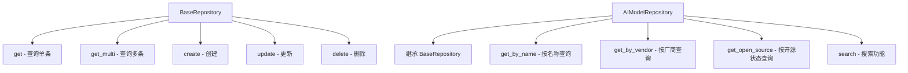
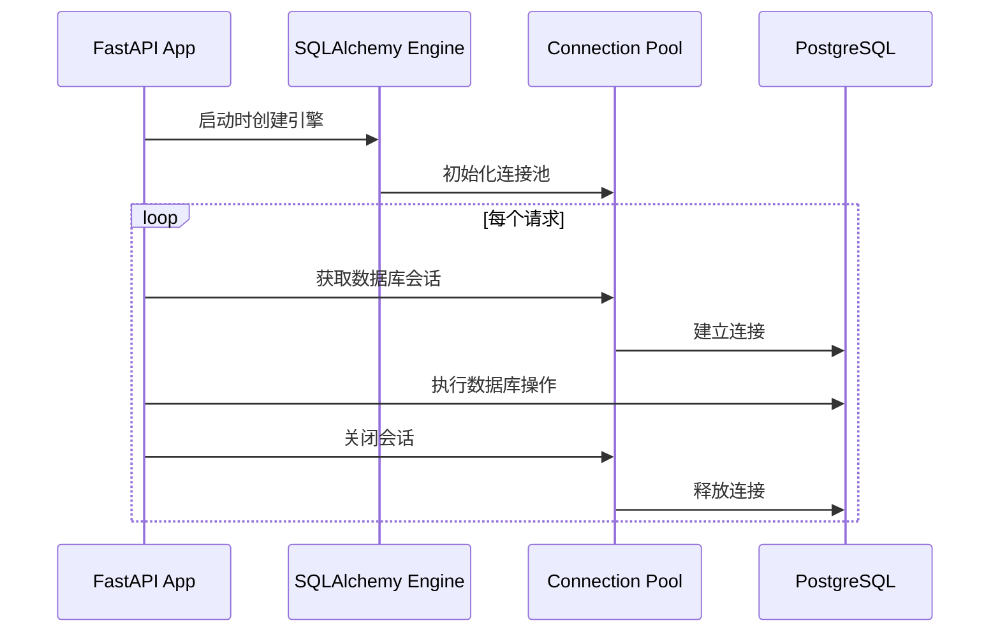
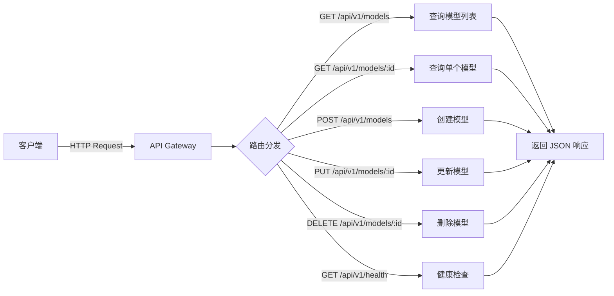
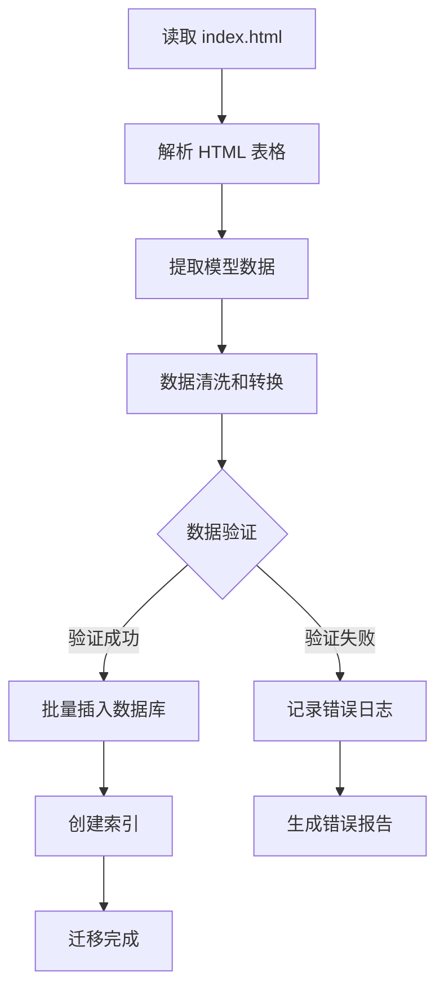
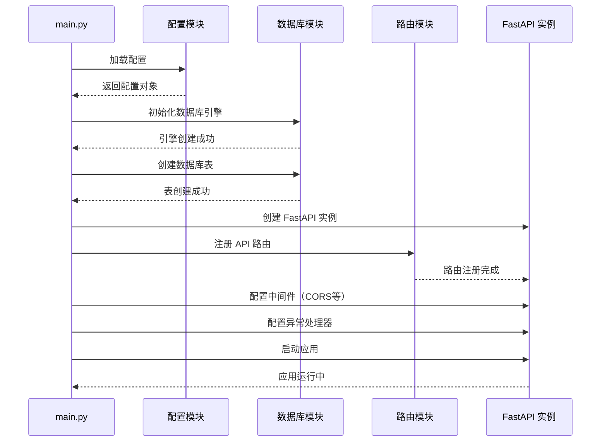
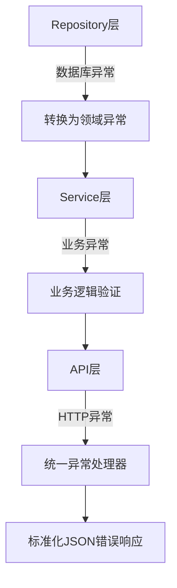
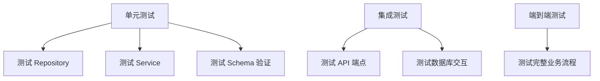

# FastAPI 项目目录架构设计

## 设计目标

为 ai-info 项目构建一个标准的 FastAPI 后端架构，提供以下核心能力：
- AI 模型数据的完整 CRUD 操作
- RESTful API 接口服务
- 数据持久化存储
- 清晰的分层架构设计
- 可扩展的项目结构

## 项目目录结构

```
ai-info/
├── backend/                          # 后端根目录
│   ├── app/                          # 应用核心代码
│   │   ├── __init__.py
│   │   ├── main.py                   # FastAPI 应用入口
│   │   ├── config.py                 # 配置管理
│   │   ├── dependencies.py           # 全局依赖注入
│   │   │
│   │   ├── api/                      # API 路由层
│   │   │   ├── __init__.py
│   │   │   ├── v1/                   # API 版本 1
│   │   │   │   ├── __init__.py
│   │   │   │   ├── router.py         # 聚合所有路由
│   │   │   │   ├── models.py         # AI 模型相关路由
│   │   │   │   └── health.py         # 健康检查路由
│   │   │   └── deps.py               # API 层依赖
│   │   │
│   │   ├── core/                     # 核心功能模块
│   │   │   ├── __init__.py
│   │   │   ├── config.py             # 核心配置类
│   │   │   └── security.py           # 安全相关（未来扩展）
│   │   │
│   │   ├── db/                       # 数据库层
│   │   │   ├── __init__.py
│   │   │   ├── base.py               # 数据库基础配置
│   │   │   ├── session.py            # 数据库会话管理
│   │   │   └── init_db.py            # 数据库初始化脚本
│   │   │
│   │   ├── models/                   # 数据库模型层（ORM）
│   │   │   ├── __init__.py
│   │   │   ├── ai_model.py           # AI 模型实体
│   │   │   └── base.py               # 模型基类
│   │   │
│   │   ├── schemas/                  # Pydantic 数据验证模式
│   │   │   ├── __init__.py
│   │   │   ├── ai_model.py           # AI 模型数据模式
│   │   │   └── common.py             # 通用响应模式
│   │   │
│   │   ├── services/                 # 业务逻辑层
│   │   │   ├── __init__.py
│   │   │   └── ai_model_service.py   # AI 模型业务逻辑
│   │   │
│   │   ├── repositories/             # 数据访问层
│   │   │   ├── __init__.py
│   │   │   ├── base.py               # 基础 CRUD 仓储
│   │   │   └── ai_model_repo.py      # AI 模型数据访问
│   │   │
│   │   └── utils/                    # 工具函数
│   │       ├── __init__.py
│   │       └── logger.py             # 日志工具
│   │
│   ├── tests/                        # 测试目录
│   │   ├── __init__.py
│   │   ├── conftest.py               # 测试配置
│   │   ├── api/                      # API 测试
│   │   │   └── test_models.py
│   │   └── services/                 # 服务测试
│   │       └── test_ai_model_service.py
│   │
│   ├── alembic/                      # 数据库迁移
│   │   ├── versions/                 # 迁移版本
│   │   ├── env.py
│   │   └── script.py.mako
│   │
│   ├── scripts/                      # 辅助脚本
│   │   ├── init_data.py              # 初始化数据脚本
│   │   └── migrate_from_html.py      # 从 HTML 迁移数据
│   │
│   ├── .env.example                  # 环境变量示例
│   ├── .env                          # 环境变量（不提交到版本控制）
│   ├── .gitignore
│   ├── alembic.ini                   # Alembic 配置
│   ├── requirements.txt              # 依赖包列表
│   ├── pyproject.toml                # 项目配置（可选）
│   └── README.md                     # 后端说明文档
│
├── frontend/                         # 前端目录（迁移现有 HTML）
│   └── index.html                    # 现有的静态页面
│
└── README.md                         # 项目总体说明
```

## 架构分层说明

### 1. API 路由层（api/）

**职责**：处理 HTTP 请求和响应，参数验证，路由分发

**关键文件**：
- `v1/router.py`：聚合所有 v1 版本的路由
- `v1/models.py`：AI 模型相关的 API 端点
- `v1/health.py`：健康检查端点

**设计原则**：
- 路由层只负责接收请求和返回响应
- 不包含业务逻辑
- 使用 Pydantic Schema 进行数据验证
- 支持 API 版本管理

### 2. 数据验证层（schemas/）

**职责**：定义请求和响应的数据结构，进行数据验证

**关键模式**：

| 模式名称 | 用途 | 主要字段 |
|---------|------|---------|
| AIModelBase | 基础模型属性 | 名称、厂商、版本等 |
| AIModelCreate | 创建模型请求 | 继承 Base，添加必填验证 |
| AIModelUpdate | 更新模型请求 | 继承 Base，字段可选 |
| AIModelInDB | 数据库模型 | 继承 Base，添加 ID、时间戳 |
| AIModelResponse | API 响应 | 继承 InDB，格式化输出 |
| PaginatedResponse | 分页响应 | 数据列表、总数、页码 |

**设计原则**：
- 使用 Pydantic 进行自动验证
- 区分输入输出模式
- 支持数据转换和序列化

### 3. 业务逻辑层（services/）

**职责**：实现核心业务逻辑，协调多个数据访问操作

**核心服务**：
- `AIModelService`：AI 模型业务逻辑处理
  - 模型信息的增删改查
  - 复杂查询逻辑（按厂商、开源状态筛选）
  - 数据聚合和统计
  - 业务规则验证

**设计原则**：
- 业务逻辑集中管理
- 依赖注入 Repository 层
- 事务管理
- 异常处理和错误转换

### 4. 数据访问层（repositories/）

**职责**：封装数据库操作，提供统一的数据访问接口

**基础 CRUD 操作**：



**设计原则**：
- 封装所有数据库操作
- 使用 SQLAlchemy ORM
- 提供类型安全的查询接口
- 支持复杂查询构建

### 5. 数据模型层（models/）

**职责**：定义数据库表结构，映射 ORM 模型

**AI 模型实体结构**：

| 字段名 | 类型 | 说明 | 约束 |
|--------|------|------|------|
| id | Integer | 主键 | 自增 |
| name | String(100) | 模型名称 | 唯一、非空 |
| latest_version | String(50) | 最新版本 | 可空 |
| vendor | String(100) | 厂商/团队 | 非空 |
| region | String(20) | 国内/国外 | 非空 |
| is_open_source | String(20) | 开源状态 | 枚举（是/否/部分） |
| pricing_info | Text | 定价信息 | 可空 |
| performance_features | JSON | 性能特点列表 | 可空 |
| reference_url | String(500) | 参考链接 | 可空 |
| created_at | DateTime | 创建时间 | 自动生成 |
| updated_at | DateTime | 更新时间 | 自动更新 |

**设计原则**：
- 使用 SQLAlchemy 声明式基类
- 定义索引优化查询
- 使用 JSON 类型存储复杂数据
- 添加时间戳字段

### 6. 数据库层（db/）

**职责**：数据库连接管理、会话管理、初始化

**连接管理流程**：



**设计原则**：
- 使用连接池提高性能
- 依赖注入提供会话
- 自动会话管理（请求结束自动关闭）
- 支持事务回滚

### 7. 核心配置层（core/）

**职责**：管理应用配置、环境变量、全局设置

**配置项分类**：

| 配置类别 | 配置项 | 说明 |
|---------|--------|------|
| 应用配置 | APP_NAME | 应用名称 |
|          | VERSION | 版本号 |
|          | DEBUG | 调试模式 |
| 数据库配置 | DATABASE_URL | 数据库连接字符串 |
|           | DB_POOL_SIZE | 连接池大小 |
| API 配置 | API_V1_PREFIX | API v1 前缀路径 |
|          | CORS_ORIGINS | 跨域白名单 |
| 日志配置 | LOG_LEVEL | 日志级别 |
|          | LOG_FILE | 日志文件路径 |

**设计原则**：
- 使用 Pydantic Settings 管理配置
- 支持环境变量覆盖
- 配置验证和类型检查
- 区分开发/生产环境

## API 端点设计

### RESTful API 规范



### API 端点列表

| 方法 | 路径 | 功能 | 请求参数 | 响应 |
|------|------|------|---------|------|
| GET | /api/v1/models | 获取模型列表 | skip, limit, vendor, is_open_source | 分页的模型列表 |
| GET | /api/v1/models/{id} | 获取单个模型 | id（路径参数） | 模型详情 |
| POST | /api/v1/models | 创建模型 | AIModelCreate（请求体） | 创建的模型 |
| PUT | /api/v1/models/{id} | 更新模型 | id, AIModelUpdate（请求体） | 更新后的模型 |
| DELETE | /api/v1/models/{id} | 删除模型 | id（路径参数） | 成功消息 |
| GET | /api/v1/models/search | 搜索模型 | q（查询关键词） | 匹配的模型列表 |
| GET | /api/v1/health | 健康检查 | 无 | 服务状态 |

### 请求响应示例

**获取模型列表请求**：
- 端点：`GET /api/v1/models?skip=0&limit=10&vendor=OpenAI`
- 响应格式：
  - 状态码：200
  - 响应体结构：包含数据列表、总数、当前页、每页数量

**创建模型请求**：
- 端点：`POST /api/v1/models`
- 请求体必填字段：名称、厂商、地区
- 请求体可选字段：版本、开源状态、定价信息、性能特点、参考链接
- 响应格式：
  - 状态码：201（创建成功）
  - 响应体：创建的模型完整信息（包含生成的 ID 和时间戳）

**错误响应格式**：
- 状态码：4xx（客户端错误）或 5xx（服务器错误）
- 响应体结构：错误码、错误消息、详细信息（可选）

## 数据迁移策略

### 从 HTML 迁移到数据库

**迁移流程**：



**迁移脚本功能**：
- 解析现有 HTML 中的表格数据
- 数据格式转换和清洗
- 批量导入到 PostgreSQL
- 验证数据完整性
- 生成迁移报告

**数据清洗规则**：
- 开源状态标准化：是/否/部分
- 定价信息格式统一
- 性能特点转换为 JSON 数组
- URL 有效性验证

## 依赖包清单

### 核心依赖

| 包名 | 版本 | 用途 |
|------|------|------|
| fastapi | ^0.104.0 | Web 框架 |
| uvicorn | ^0.24.0 | ASGI 服务器 |
| sqlalchemy | ^2.0.0 | ORM 框架 |
| psycopg2-binary | ^2.9.0 | PostgreSQL 驱动 |
| pydantic | ^2.5.0 | 数据验证 |
| pydantic-settings | ^2.1.0 | 配置管理 |
| alembic | ^1.13.0 | 数据库迁移 |
| python-dotenv | ^1.0.0 | 环境变量管理 |

### 开发依赖

| 包名 | 版本 | 用途 |
|------|------|------|
| pytest | ^7.4.0 | 测试框架 |
| pytest-asyncio | ^0.21.0 | 异步测试支持 |
| httpx | ^0.25.0 | HTTP 客户端（测试用） |
| black | ^23.12.0 | 代码格式化 |
| flake8 | ^6.1.0 | 代码检查 |
| mypy | ^1.7.0 | 类型检查 |

## 应用启动流程



**启动步骤**：
1. 加载环境变量和配置
2. 初始化日志系统
3. 创建数据库引擎和连接池
4. 执行数据库迁移（如需要）
5. 创建 FastAPI 应用实例
6. 注册 API 路由
7. 配置 CORS 中间件
8. 配置全局异常处理
9. 启动 Uvicorn 服务器

## 开发规范

### 代码组织原则

1. **单一职责**：每个模块、类、函数只负责一个明确的功能
2. **依赖注入**：使用 FastAPI 的依赖注入系统管理依赖
3. **分层解耦**：严格遵守分层架构，上层依赖下层，下层不依赖上层
4. **接口优先**：定义清晰的接口和数据契约

### 命名规范

| 类型 | 命名规则 | 示例 |
|------|---------|------|
| 文件名 | 小写+下划线 | ai_model_service.py |
| 类名 | 大驼峰 | AIModelService |
| 函数名 | 小写+下划线 | get_model_by_id |
| 变量名 | 小写+下划线 | model_list |
| 常量名 | 大写+下划线 | DATABASE_URL |
| 私有成员 | 单下划线前缀 | _internal_method |

### 异常处理策略

**异常层级**：



**异常处理原则**：
- Repository 层捕获数据库异常，转换为领域异常
- Service 层处理业务逻辑异常
- API 层捕获所有异常，转换为 HTTP 异常
- 全局异常处理器格式化错误响应

### 日志记录策略

**日志级别使用**：
- DEBUG：详细的调试信息
- INFO：关键业务流程节点
- WARNING：潜在问题警告
- ERROR：错误信息（需要关注）
- CRITICAL：严重错误（需要立即处理）

**日志记录位置**：
- API 层：记录请求入口和响应
- Service 层：记录业务操作
- Repository 层：记录数据库操作
- 异常处理：记录所有异常栈

## 环境配置说明

### 环境变量配置

**必需环境变量**：
- `DATABASE_URL`：数据库连接字符串（格式：postgresql://用户名:密码@主机:端口/数据库名）
- `SECRET_KEY`：应用密钥（用于安全功能）

**可选环境变量**：
- `DEBUG`：调试模式（默认：False）
- `LOG_LEVEL`：日志级别（默认：INFO）
- `CORS_ORIGINS`：允许的跨域来源（默认：所有）
- `API_V1_PREFIX`：API v1 路径前缀（默认：/api/v1）

### 数据库配置

**PostgreSQL 推荐配置**：
- 版本：PostgreSQL 14 或更高
- 字符集：UTF-8
- 连接池大小：10-20（根据负载调整）
- 超时设置：连接超时 30 秒

**开发环境**：
- 可以使用 Docker 快速启动 PostgreSQL
- 建议使用独立的开发数据库

**生产环境**：
- 使用托管数据库服务或专用数据库服务器
- 配置备份策略
- 启用连接池和查询缓存

## 测试策略

### 测试层级



### 测试覆盖目标

| 层级 | 测试内容 | 覆盖率目标 |
|------|---------|-----------|
| Repository | CRUD 操作、复杂查询 | 90% |
| Service | 业务逻辑、异常处理 | 85% |
| API | 端点响应、参数验证 | 80% |

### 测试数据管理

**测试数据策略**：
- 使用独立的测试数据库
- 每次测试前创建干净的数据库环境
- 使用 Fixture 准备测试数据
- 测试后自动清理数据

## 部署方案

### Docker 容器化部署

**容器组成**：
- FastAPI 应用容器
- PostgreSQL 数据库容器
- Nginx 反向代理容器（可选）

**部署流程**：


### 运行命令

**本地开发启动**：
- 开发模式运行（支持热重载）
- 监听地址：127.0.0.1:8000

**生产环境启动**：
- 使用多进程模式
- 工作进程数：CPU 核心数 × 2 + 1
- 监听地址：0.0.0.0:8000

## 扩展规划

### 短期扩展（1-3个月）

1. **用户认证系统**
   - 用户注册和登录
   - JWT Token 认证
   - 权限控制

2. **数据缓存**
   - Redis 缓存层
   - 查询结果缓存
   - 提高响应速度

3. **API 文档增强**
   - 自动生成 OpenAPI 文档
   - 交互式 API 测试界面

### 中期扩展（3-6个月）

1. **高级搜索功能**
   - 全文搜索
   - 多条件组合查询
   - 搜索结果排序

2. **数据分析接口**
   - 模型统计分析
   - 趋势分析
   - 数据可视化支持

3. **批量操作**
   - 批量导入
   - 批量更新
   - 数据导出

### 长期扩展（6个月以上）

1. **微服务架构演进**
   - 服务拆分
   - API Gateway
   - 服务发现

2. **实时数据同步**
   - WebSocket 支持
   - 实时数据推送
   - 数据变更通知

3. **多租户支持**
   - 租户隔离
   - 配额管理
   - 个性化配置

## 安全考虑

### API 安全措施

| 安全措施 | 实现方式 | 优先级 |
|---------|---------|--------|
| HTTPS | SSL/TLS 证书 | 高 |
| CORS 配置 | 限制允许的域名 | 高 |
| 请求限流 | 基于 IP 的速率限制 | 中 |
| SQL 注入防护 | ORM 参数化查询 | 高 |
| XSS 防护 | 输入验证和输出编码 | 高 |
| 认证授权 | JWT Token（未来） | 中 |

### 数据安全

**敏感数据处理**：
- 环境变量存储敏感配置
- 数据库密码加密存储
- API 密钥定期轮换

**访问控制**：
- 数据库最小权限原则
- API 访问日志记录
- 异常访问监控

## 性能优化

### 数据库优化

**索引策略**：
- 在 name 字段创建唯一索引
- 在 vendor 字段创建普通索引
- 在 is_open_source 字段创建索引
- 为常用查询字段组合创建复合索引

**查询优化**：
- 使用分页避免一次性加载大量数据
- 懒加载关联数据
- 查询结果缓存
- 数据库连接池复用

### 应用优化

**响应优化**：
- 使用异步处理提高并发能力
- 响应数据压缩
- 静态资源 CDN 加速

**资源管理**：
- 合理配置工作进程数
- 内存使用监控
- 数据库连接池大小优化

## 监控和维护

### 应用监控

**监控指标**：
- API 响应时间
- 请求成功率
- 错误率统计
- 数据库查询性能

**监控工具**：
- 应用性能监控（APM）
- 日志聚合和分析
- 实时告警通知

### 日常维护

**数据库维护**：
- 定期备份数据库
- 清理过期日志
- 优化数据库表
- 更新统计信息

**应用维护**：
- 依赖包安全更新
- 日志文件轮转
- 性能瓶颈分析
- 代码质量审查- 性能瓶颈分析
