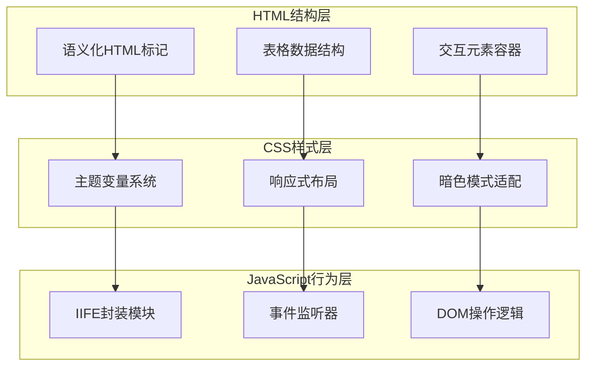
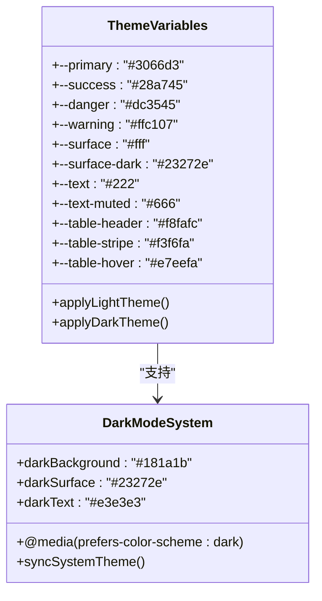
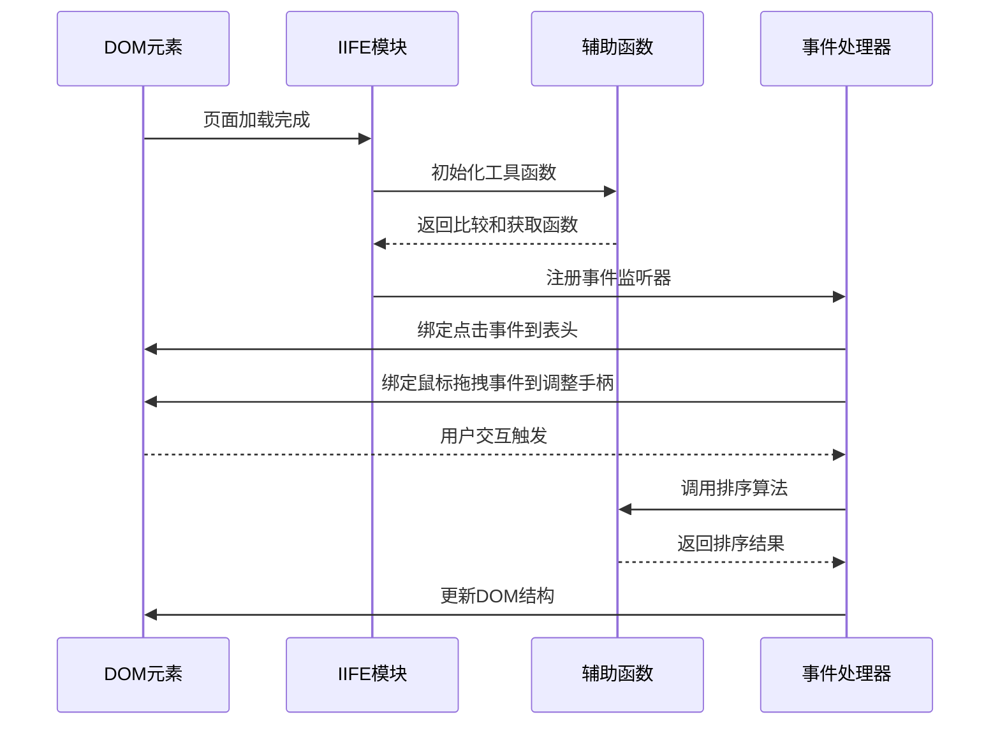
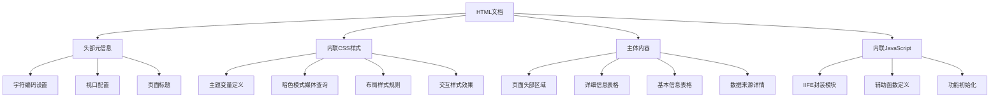
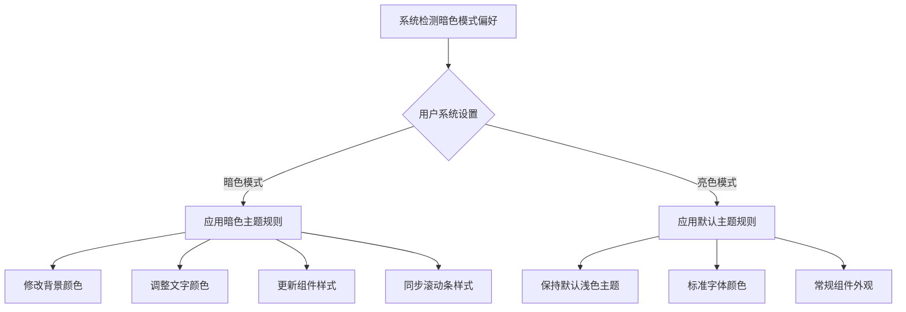
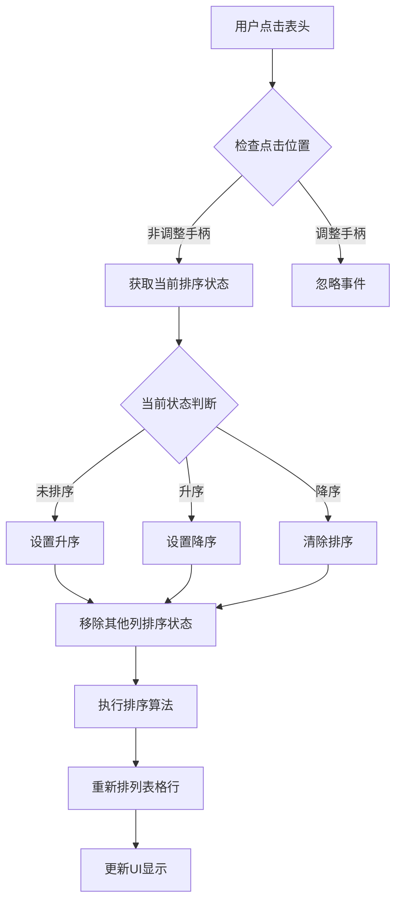
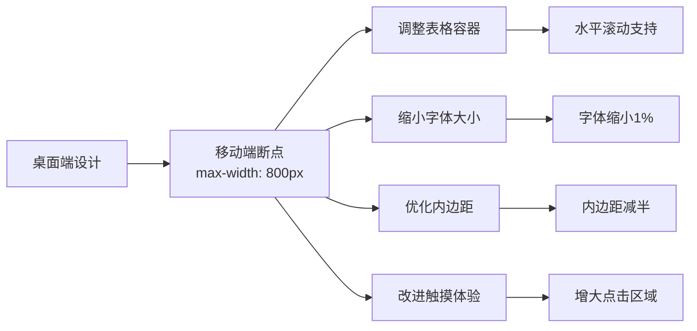

# 技术架构

<cite>
**本文档引用的文件**
- [index.html](file://index.html)
</cite>

## 目录
1. [项目概述](#项目概述)
2. [技术架构总览](#技术架构总览)
3. [前端三层分离模式](#前端三层分离模式)
4. [单文件架构设计](#单文件架构设计)
5. [主题管理系统](#主题管理系统)
6. [表格交互功能](#表格交互功能)
7. [无框架技术方案优势](#无框架技术方案优势)
8. [响应式设计实现](#响应式设计实现)
9. [性能优化策略](#性能优化策略)
10. [最佳实践总结](#最佳实践总结)

## 项目概述

该项目是一个纯静态的HTML页面，展示了AI模型信息的汇总数据。整个应用采用无框架的原生Web技术方案，在单个HTML文件中实现了完整的交互式功能，体现了现代前端开发的经典三层分离架构模式。

**章节来源**
- [index.html](file://index.html#L1-L434)

## 技术架构总览

该项目采用了经典的前端三层分离架构，将HTML结构、CSS样式和JavaScript行为完全分离，形成了清晰的技术层次：

**图表来源**
- [index.html](file://index.html#L1-L251)

## 前端三层分离模式

### HTML结构层 - 语义化标记

HTML部分采用了严格的语义化标记规范，确保内容结构的清晰性和可访问性：

- **头部区域**：包含标题和更新时间信息
- **主体内容**：分为两个主要表格区域
- **详情区域**：提供数据来源链接
- **语义化标签**：合理使用`<header>`、`<section>`、`<table>`等标签

### CSS样式层 - 主题变量系统

CSS层采用了现代化的主题变量系统，通过`:root`伪类定义全局变量：

**图表来源**
- [index.html](file://index.html#L8-L24)
- [index.html](file://index.html#L25-L49)

### JavaScript行为层 - 交互功能

JavaScript部分采用立即执行函数(IIFE)封装，实现了表格的排序和列宽调整功能：

**图表来源**
- [index.html](file://index.html#L346-L431)

**章节来源**
- [index.html](file://index.html#L1-L251)

## 单文件架构设计

### 完整功能实现

该项目在单个HTML文件中实现了以下完整功能：

1. **数据展示**：两个主要表格展示AI模型的详细信息和基本信息
2. **交互功能**：表格列排序和列宽调整
3. **主题切换**：支持明暗两种主题模式
4. **响应式设计**：适应不同屏幕尺寸的显示效果

### 文件结构组织

**图表来源**
- [index.html](file://index.html#L1-L434)

**章节来源**
- [index.html](file://index.html#L1-L434)

## 主题管理系统

### CSS变量定义

项目使用`:root`伪类定义了完整的主题变量系统，包含以下核心变量类别：

| 变量类别 | 变量名 | 默认值 | 暗色模式值 |
|---------|--------|--------|-----------|
| 主色调 | `--primary` | `#3066d3` | `#3066d3` |
| 成功状态 | `--success` | `#28a745` | `#28a745` |
| 错误状态 | `--danger` | `#dc3545` | `#dc3545` |
| 警告状态 | `--warning` | `#ffc107` | `#ffc107` |
| 表面背景 | `--surface` | `#fff` | `#23272e` |
| 文本颜色 | `--text` | `#222` | `#e3e3e3` |
| 表头背景 | `--table-header` | `#f8fafc` | `#23272e` |
| 表格条纹 | `--table-stripe` | `#f3f6fa` | `#23272e` |
| 表格悬停 | `--table-hover` | `#e7eefa` | `#323843` |

### 暗色模式适配机制

项目通过`@media (prefers-color-scheme: dark)`媒体查询实现了系统级暗色模式同步：

**图表来源**
- [index.html](file://index.html#L25-L49)

**章节来源**
- [index.html](file://index.html#L8-L49)

## 表格交互功能

### 排序功能实现

JavaScript模块实现了智能表格排序功能，支持以下特性：

1. **多类型排序**：数字优先于字符串
2. **双向排序**：升序和降序切换
3. **状态管理**：单列同时只能有一个排序状态
4. **本地化支持**：中文字符串比较

**图表来源**
- [index.html](file://index.html#L363-L388)

### 列宽调整功能

列宽调整功能提供了直观的用户体验：

1. **拖拽手柄**：每个表头右侧添加调整手柄
2. **动态计算**：实时计算相邻列的宽度变化
3. **最小宽度限制**：防止列宽过小影响阅读
4. **视觉反馈**：鼠标状态变化提示

**章节来源**
- [index.html](file://index.html#L346-L431)

## 无框架技术方案优势

### 性能优势

1. **加载速度**：单文件传输，无需额外资源加载
2. **缓存友好**：单一文件便于浏览器缓存
3. **解析效率**：HTML解析速度快，渲染及时

### 维护优势

1. **代码简洁**：无第三方依赖，代码易于理解和维护
2. **版本控制**：单一文件便于版本管理和协作
3. **调试方便**：无构建过程，直接调试源码

### 风险控制

1. **依赖消除**：无外部库依赖，避免版本冲突
2. **安全性**：减少攻击面，降低安全风险
3. **稳定性**：原生API保证长期兼容性

### 开发效率

1. **快速启动**：无需复杂的开发环境配置
2. **即时预览**：直接在浏览器中查看效果
3. **灵活扩展**：可根据需要逐步添加功能

## 响应式设计实现

### 移动端适配

项目针对移动设备进行了专门的优化：

**图表来源**
- [index.html](file://index.html#L170-L182)

### 视觉一致性

在不同设备上保持视觉一致性：

1. **字体缩放**：移动端字体相对缩小
2. **间距调整**：移动端使用更紧凑的间距
3. **交互优化**：大按钮和触摸友好的设计
4. **滚动体验**：自定义滚动条提升移动端体验

**章节来源**
- [index.html](file://index.html#L170-L182)

## 性能优化策略

### 样式优化

1. **选择器优化**：使用高效的CSS选择器
2. **属性压缩**：合并重复的样式属性
3. **媒体查询优化**：合理使用断点
4. **动画性能**：使用CSS3硬件加速

### 脚本优化

1. **IIFE封装**：避免全局变量污染
2. **事件委托**：减少事件监听器数量
3. **DOM操作优化**：批量更新DOM
4. **内存管理**：及时清理事件监听器

### 渲染优化

1. **关键路径优化**：内联关键CSS
2. **异步加载**：非关键资源延迟加载
3. **缓存策略**：利用浏览器缓存
4. **压缩传输**：减少文件体积

## 最佳实践总结

### 架构设计原则

1. **关注点分离**：严格分离HTML、CSS、JavaScript
2. **模块化思维**：使用IIFE实现功能模块化
3. **渐进增强**：在基础功能上添加高级特性
4. **向后兼容**：确保在旧浏览器中的基本可用性

### 代码质量保证

1. **语义化标记**：使用合适的HTML标签
2. **可访问性**：考虑残障用户的使用需求
3. **国际化支持**：支持中文和其他语言
4. **测试覆盖**：在多种设备和浏览器上测试

### 维护性考虑

1. **注释规范**：为复杂逻辑添加注释
2. **命名约定**：使用一致的命名规范
3. **文档维护**：保持文档与代码同步
4. **版本管理**：记录重要变更和更新

这种无框架的原生Web技术方案在保持高性能的同时，提供了良好的用户体验和可维护性，是现代Web开发中值得借鉴的架构模式。