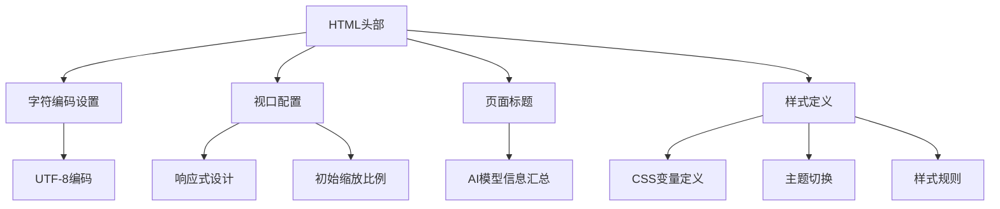
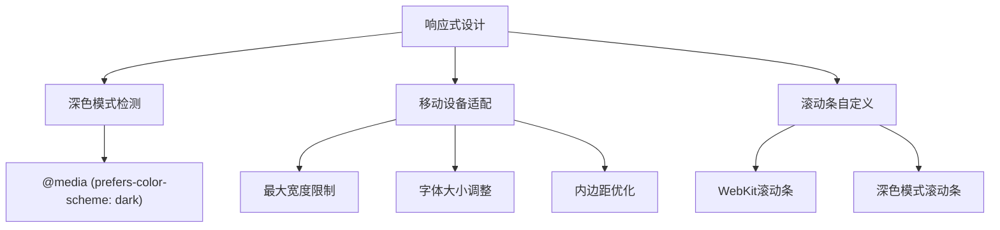
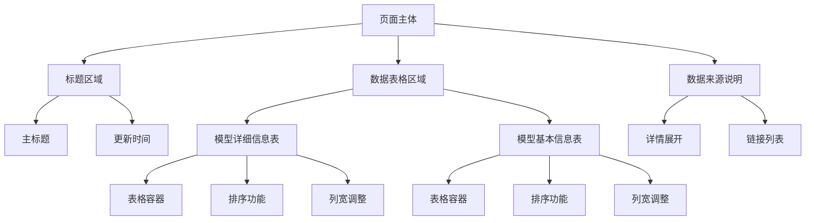
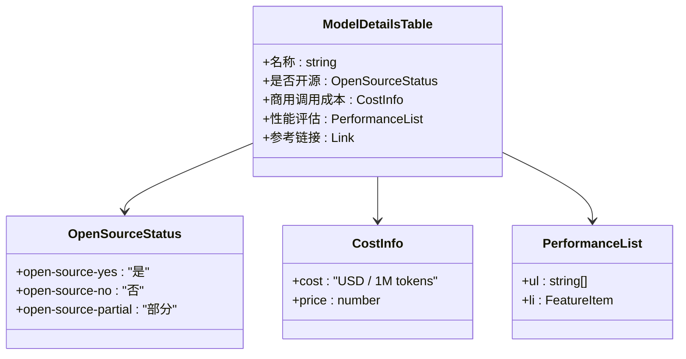
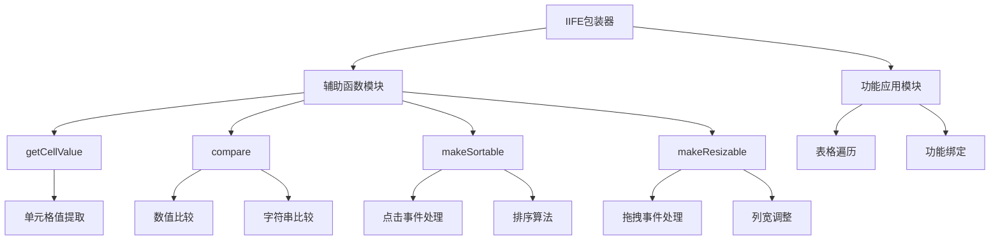
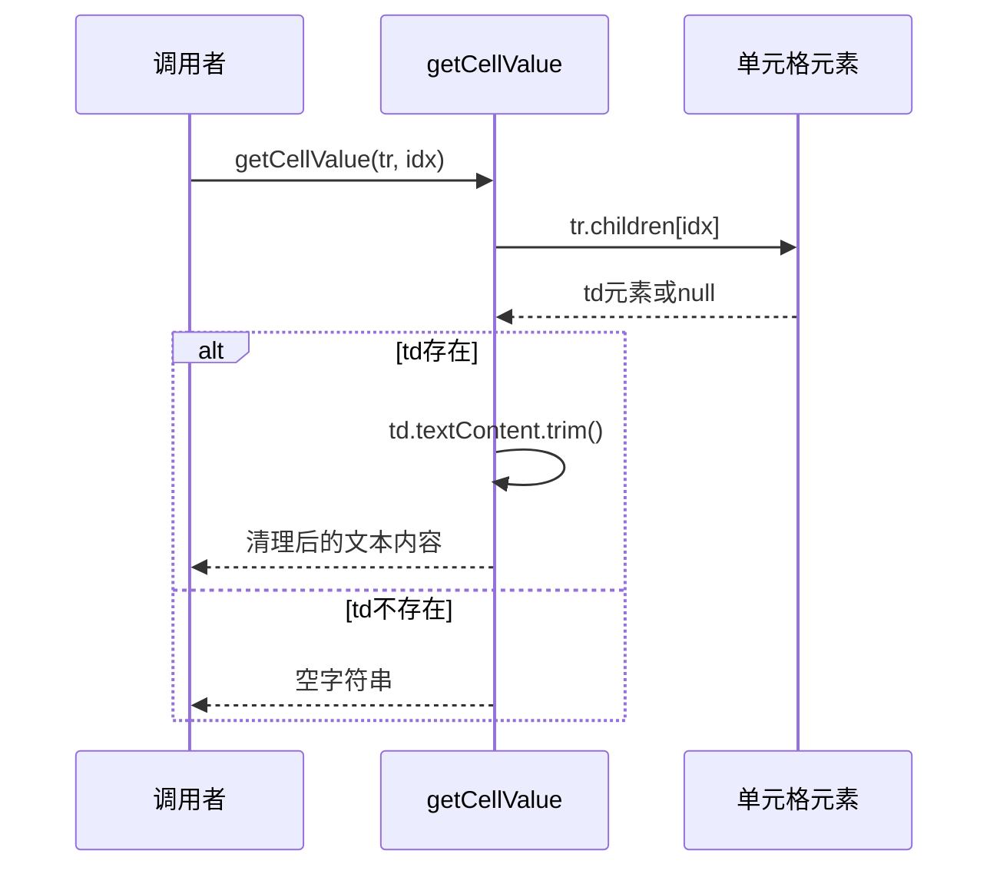
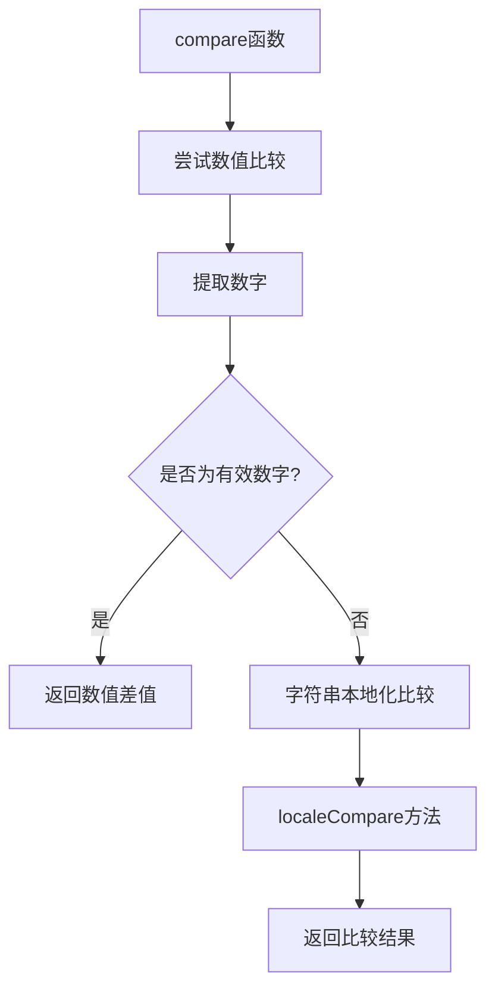
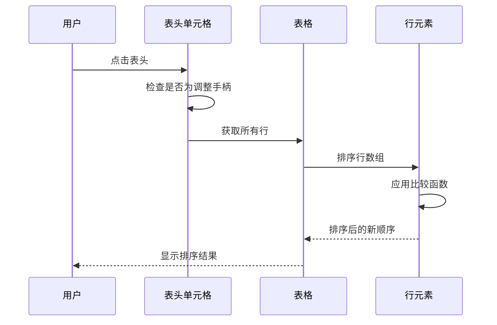
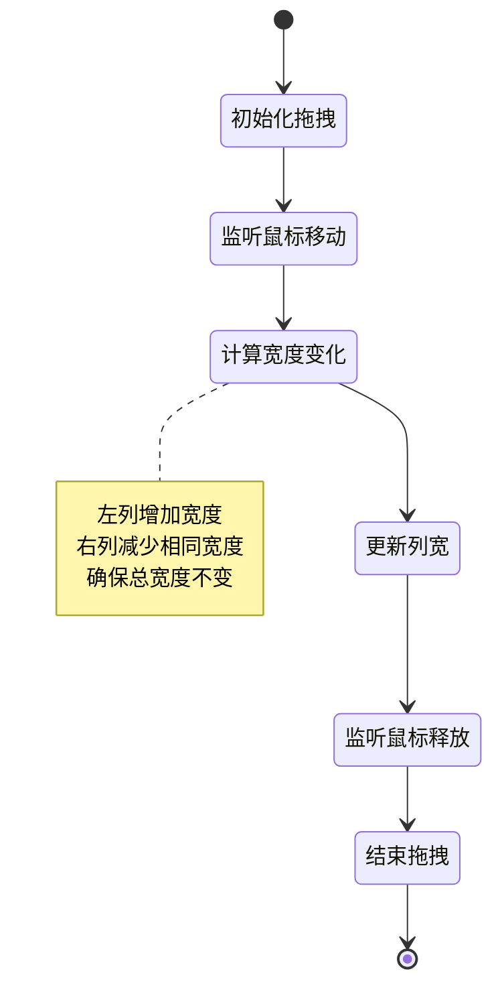
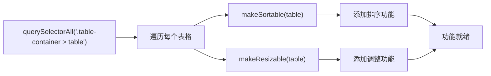

# index.html 文件结构说明

<cite>
**本文档引用的文件**
- [index.html](file://index.html)
</cite>

## 目录
1. [简介](#简介)
2. [HTML头部结构分析](#html头部结构分析)
3. [页面主体结构分析](#页面主体结构分析)
4. [JavaScript功能实现分析](#javascript功能实现分析)
5. [设计选择与性能影响](#设计选择与性能影响)
6. [总结](#总结)

## 简介

本文档详细分析了index.html文件的完整结构，该文件是一个展示AI模型信息的静态网页。文件采用完全内联的方式整合了HTML、CSS和JavaScript代码，这种设计选择在性能和部署方面具有特定的优势和特点。

## HTML头部结构分析

### 元信息配置

HTML头部包含了完整的元信息配置，为页面提供了基础的浏览器兼容性和用户体验保障：

**图表来源**
- [index.html](file://index.html#L1-L7)

### CSS变量系统

文件定义了一套完整的CSS变量系统，支持深色模式和浅色模式的无缝切换：

| 变量类别 | 变量名 | 默认值 | 深色模式值 | 用途 |
|---------|--------|--------|-----------|------|
| 主色调 | `--primary` | #3066d3 | #3066d3 | 标题和链接颜色 |
| 成功状态 | `--success` | #28a745 | #28a745 | 开源状态标识 |
| 错误状态 | `--danger` | #dc3545 | #dc3545 | 非开源状态标识 |
| 警告状态 | `--warning` | #ffc107 | #ffc107 | 部分开源状态标识 |
| 表面颜色 | `--surface` | #fff | #23272e | 背景表面色 |
| 文本颜色 | `--text` | #222 | #e3e3e3 | 主要文本色 |
| 表格主题 | `--table-header` | #f8fafc | #23272e | 表头背景色 |

**章节来源**
- [index.html](file://index.html#L8-L23)

### 响应式布局设置

文件实现了完整的响应式布局系统，通过媒体查询确保在不同设备上的最佳显示效果：

**图表来源**
- [index.html](file://index.html#L25-L246)

**章节来源**
- [index.html](file://index.html#L1-L246)

## 页面主体结构分析

### 整体布局架构

页面采用简洁的分层结构，包含标题区域、数据表格区域和数据来源说明：

**图表来源**
- [index.html](file://index.html#L253-L344)

### 标题区域设计

标题区域采用了简洁而专业的设计，包含主标题和更新时间信息：

| 元素 | 样式特性 | 功能作用 |
|------|----------|----------|
| 主标题 | 主色调蓝色，大字体，加粗 | 明确页面主题 |
| 更新时间 | 次要文本色，较小字体 | 提供数据时效性信息 |

**章节来源**
- [index.html](file://index.html#L254-L257)

### 数据表格结构

页面包含两个主要的数据表格，每个表格都封装在`.table-container`容器中：

#### 模型详细信息表

该表格展示了AI模型的详细技术信息：

**图表来源**
- [index.html](file://index.html#L261-L288)

#### 模型基本信息表

该表格提供AI模型的基础信息概览：

| 列名 | 数据类型 | 示例值 |
|------|----------|--------|
| 名称 | 字符串 | "OpenAI GPT-4o" |
| 最新版本 | 字符串 | "GPT-4o 2024-05" |
| 厂商/团队 | 字符串 | "OpenAI" |
| 是否国内/国外 | 字符串 | "国外" |

**章节来源**
- [index.html](file://index.html#L258-L322)

### CSS类语义化设计

文件中使用了语义化的CSS类来标识不同类型的数据：

| 类名 | 颜色值 | 字重 | 语义含义 |
|------|--------|------|----------|
| `.open-source-yes` | `var(--success)` | 600 | 完全开源 |
| `.open-source-no` | `var(--danger)` | 600 | 完全非开源 |
| `.open-source-partial` | `var(--warning)` | 600 | 部分开源 |
| `.cost` | #2e8b57 | 700 | 商用成本信息 |

**章节来源**
- [index.html](file://index.html#L195-L209)

## JavaScript功能实现分析

### 函数模块化设计

JavaScript代码被封装在一个立即执行函数表达式(IIFE)中，确保全局命名空间的安全：

**图表来源**
- [index.html](file://index.html#L346-L431)

### 核心功能函数详解

#### getCellValue函数

该函数负责从表格单元格中提取可比较的值：

**图表来源**
- [index.html](file://index.html#L349-L354)

#### compare函数

该函数实现了智能的数据类型比较逻辑：

**图表来源**
- [index.html](file://index.html#L355-L362)

#### makeSortable函数

该函数为表格添加排序功能：

**图表来源**
- [index.html](file://index.html#L363-L389)

#### makeResizable函数

该函数实现表格列宽的动态调整功能：

**图表来源**
- [index.html](file://index.html#L391-L425)

### 功能协同机制

JavaScript代码通过统一的选择器机制为所有表格应用功能：

**图表来源**
- [index.html](file://index.html#L426-L431)

**章节来源**
- [index.html](file://index.html#L346-L431)

## 设计选择与性能影响

### 内联资源设计策略

该文件采用完全内联的方式整合所有资源，这种设计选择具有以下特点：

#### 性能优势

1. **减少HTTP请求**：无需额外的CSS或JavaScript文件加载
2. **简化部署流程**：单文件即可独立运行
3. **避免跨域问题**：无外部资源依赖
4. **缓存友好**：整个页面可以被浏览器缓存

#### 性能劣势

1. **文件体积较大**：内联代码增加了HTML文件大小
2. **维护困难**：代码集中在一个文件中难以管理
3. **开发效率低**：缺乏模块化和工具链支持
4. **调试不便**：错误定位需要在单一文件中查找

### 折中考虑

这种设计适合：
- 小型静态展示页面
- 不需要频繁更新的内容
- 对首屏加载速度要求较高的场景
- 简单的交互功能需求

不适合：
- 大型复杂应用
- 需要频繁更新的内容
- 高度交互的Web应用
- 需要SEO优化的页面

## 总结

index.html文件展示了一个精心设计的静态信息展示页面，通过内联方式整合了HTML、CSS和JavaScript代码。文件结构清晰，功能完整，实现了以下核心特性：

1. **完整的响应式设计**：支持深色模式和多种设备尺寸
2. **语义化的CSS类系统**：便于理解和维护
3. **交互式表格功能**：支持排序和列宽调整
4. **简洁的JavaScript架构**：模块化设计，职责分离

这种设计在性能和可维护性之间找到了平衡，特别适合信息展示类的静态页面应用。通过内联资源的方式，确保了页面的独立性和加载效率，同时保持了良好的用户体验和视觉效果。