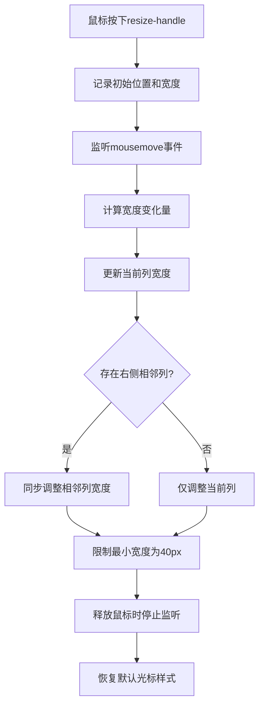
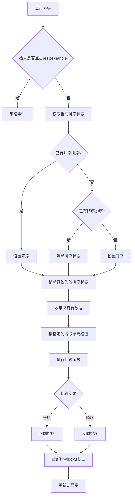
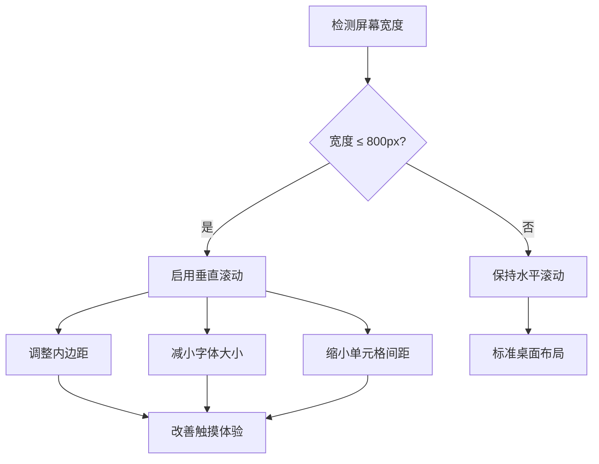
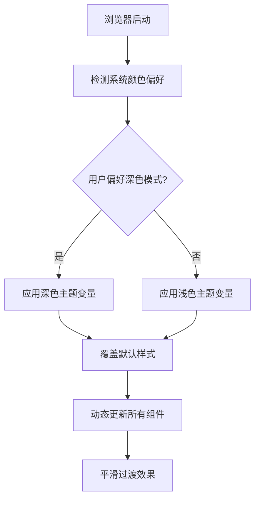

# 核心功能

<cite>
**本文档引用的文件**
- [index.html](file://index.html)
</cite>

## 目录
1. [项目概述](#项目概述)
2. [AI模型信息表格展示功能](#ai模型信息表格展示功能)
3. [表格列宽调整功能](#表格列宽调整功能)
4. [表格数据排序功能](#表格数据排序功能)
5. [响应式设计特性](#响应式设计特性)
6. [暗色模式自动切换](#暗色模式自动切换)
7. [技术实现细节](#技术实现细节)
8. [总结](#总结)

## 项目概述

本项目是一个展示AI模型信息的网页应用，主要功能包括：
- 展示详细的AI模型信息表格
- 提供表格列宽调整功能
- 实现表格数据排序功能
- 支持响应式设计和暗色模式

项目采用纯HTML+CSS+JavaScript实现，无需外部依赖，具有良好的兼容性和可维护性。

## AI模型信息表格展示功能

### 模型详细信息表格

模型详细信息表格展示了每个AI模型的核心特征，包含以下列：

| 列名 | 描述 | 数据类型 |
|------|------|----------|
| 名称 | AI模型的完整名称 | 文本字符串 |
| 是否开源 | 模型的开源状态（是/否/部分） | 状态枚举 |
| 商用调用成本 | 按Token计费的成本信息 | 数值字符串 |
| 性能评估 | 模型的主要性能特点列表 | HTML列表 |
| 参考链接 | 官方定价页面的链接 | 超链接 |

该表格采用分层展示结构：
- **基础信息层**：显示模型名称、开源状态等基本信息
- **成本信息层**：展示详细的收费模式和价格信息
- **能力展示层**：通过列表形式突出显示模型的核心能力
- **资源链接层**：提供官方定价页面的直接访问入口

### 模型基本信息表格

模型基本信息表格提供了更简洁的概览信息：

| 列名 | 描述 | 数据类型 |
|------|------|----------|
| 名称 | AI模型的完整名称 | 文本字符串 |
| 最新版本 | 当前发布的版本号 | 版本字符串 |
| 厂商/团队 | 开发该模型的公司或研究团队 | 组织名称 |
| 是否国内/国外 | 模型开发团队的地理位置分类 | 地区枚举 |

表格设计注重信息密度和可读性，采用简洁的布局和清晰的分类标识。

**章节来源**
- [index.html](file://index.html#L259-L288)
- [index.html](file://index.html#L291-L321)

## 表格列宽调整功能

### 功能原理

表格列宽调整功能通过JavaScript动态添加`.resize-handle`元素实现，提供直观的拖拽式列宽调整体验。

**图表来源**
- [index.html](file://index.html#L396-L423)

### 技术实现要点

1. **动态元素创建**：为每个表头单元格动态创建`.resize-handle`子元素
2. **事件监听机制**：使用`mousedown`、`mousemove`、`mouseup`事件链
3. **宽度约束**：设置最小宽度为40像素，防止列被过度压缩
4. **相邻列同步**：拖拽时同时调整相邻列的宽度保持总宽度不变
5. **用户体验优化**：动态修改光标样式和禁用默认行为

### 样式设计

- **视觉指示器**：通过绝对定位的10像素宽区域作为拖拽手柄
- **交互反馈**：鼠标悬停时显示蓝色背景和完全透明度
- **状态管理**：通过CSS类控制不同状态下的外观表现

**章节来源**
- [index.html](file://index.html#L391-L425)

## 表格数据排序功能

### 排序机制

表格数据排序功能实现了智能的多类型数据比较和排序算法。

**图表来源**
- [index.html](file://index.html#L363-L388)

### 数据比较算法

排序功能采用智能的数据类型识别和比较策略：

1. **数值优先**：尝试将字符串转换为浮点数进行数值比较
2. **本地化字符串比较**：对于无法转换为数值的字符串使用中文本地化比较
3. **稳定性保证**：保持相同值之间的相对顺序
4. **多列协调**：确保同一时间只有一个列处于排序状态

### 用户界面反馈

- **视觉指示**：通过CSS伪元素显示排序方向箭头
- **状态标识**：使用`sorted-asc`和`sorted-desc`类标记排序状态
- **交互提示**：sortable表头在hover时显示不同的背景色

**章节来源**
- [index.html](file://index.html#L349-L362)
- [index.html](file://index.html#L363-L388)

## 响应式设计特性

### 移动端适配

项目针对移动设备进行了专门的优化设计：

**图表来源**
- [index.html](file://index.html#L170-L182)

### 具体优化措施

1. **水平滚动容器**：`.table-container`组件提供横向滚动支持
2. **字体缩放**：在移动设备上自动减小字体大小提升可读性
3. **间距调整**：减少单元格内边距适应较小屏幕
4. **边距重置**：调整容器边距避免内容溢出

### 触摸友好设计

- **增大点击区域**：确保按钮和交互元素有足够的点击面积
- **滚动优化**：自定义滚动条样式提供更好的滚动体验
- **手势支持**：支持常见的移动端手势操作

**章节来源**
- [index.html](file://index.html#L89-L94)
- [index.html](file://index.html#L170-L182)

## 暗色模式自动切换

### 系统偏好检测

项目通过CSS媒体查询实现自动暗色模式切换：

**图表来源**
- [index.html](file://index.html#L25-L48)

### 主题变量系统

项目采用CSS自定义属性实现主题切换：

| 变量组 | 浅色模式值 | 深色模式值 | 用途 |
|--------|------------|------------|------|
| 颜色主色调 | #3066d3 | #3066d3 | 主要强调色 |
| 成功状态 | #28a745 | #28a745 | 正面状态指示 |
| 错误状态 | #dc3545 | #dc3545 | 警告状态指示 |
| 背景表面 | #fff | #23272e | 容器背景色 |
| 文本颜色 | #222 | #e3e3e3 | 主要文本色 |
| 表格头部 | #f8fafc | #23272e | 表头背景色 |
| 表格条纹 | #f3f6fa | #23272e | 偶数行背景色 |
| 悬停效果 | #e7eefa | #323843 | 鼠标悬停效果 |

### 渐进式增强

- **渐变过渡**：使用CSS过渡效果实现平滑的主题切换
- **组件级适配**：每个组件都正确使用主题变量
- **降级处理**：在不支持媒体查询的环境中提供基本功能

**章节来源**
- [index.html](file://index.html#L8-L24)
- [index.html](file://index.html#L25-L48)

## 技术实现细节

### 架构设计原则

1. **模块化组织**：将功能分离到独立的JavaScript函数中
2. **事件委托**：使用事件冒泡机制减少事件监听器数量
3. **DOM操作优化**：通过批量DOM操作提高性能
4. **可访问性考虑**：确保键盘导航和屏幕阅读器支持

### 性能优化策略

- **懒加载**：仅在需要时初始化功能
- **事件节流**：合理控制事件触发频率
- **内存管理**：及时清理事件监听器避免内存泄漏
- **选择器优化**：使用高效的CSS选择器

### 兼容性保证

- **现代浏览器支持**：基于ES5语法确保广泛兼容性
- **CSS特性检测**：优雅降级处理不支持的特性
- **渐进增强**：核心功能在所有浏览器中可用

**章节来源**
- [index.html](file://index.html#L345-L431)

## 总结

本项目通过精心设计的前端技术栈，成功实现了以下核心功能：

1. **信息展示**：清晰地组织和展示AI模型的详细信息
2. **交互增强**：提供直观的列宽调整和数据排序功能
3. **用户体验**：通过响应式设计和暗色模式满足不同使用场景
4. **技术先进性**：采用现代Web技术实现高性能和良好的可维护性

项目展现了优秀的前端工程实践，为类似的信息展示应用提供了良好的参考范例。其模块化的代码结构、完善的用户交互设计和跨平台兼容性，使其成为一个高质量的Web应用实例。