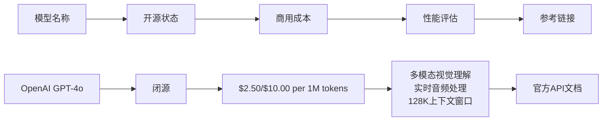
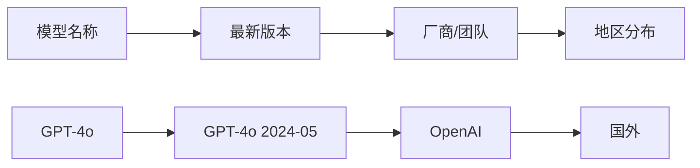
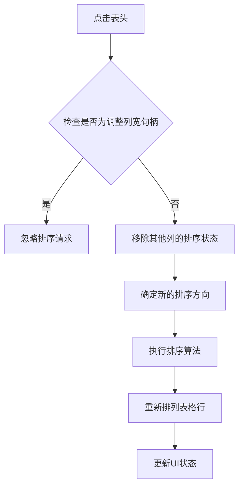
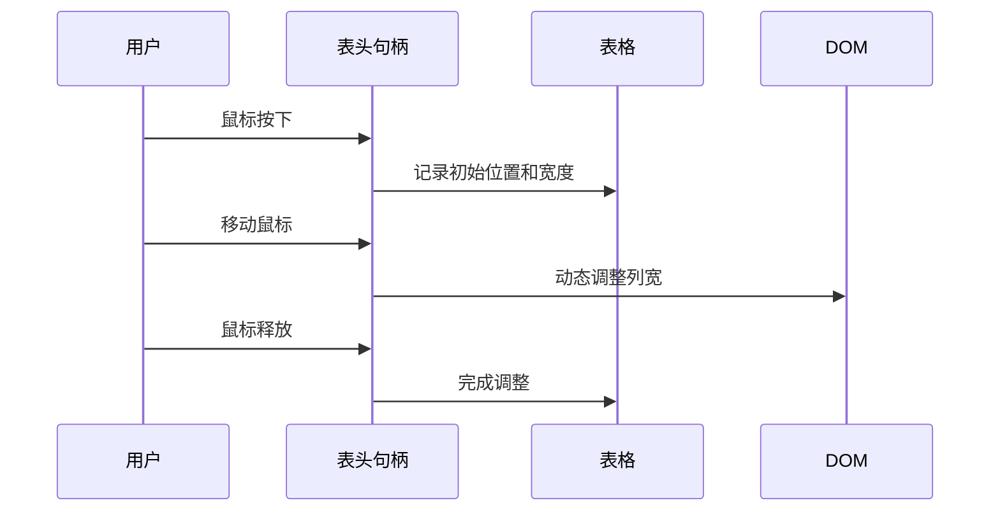
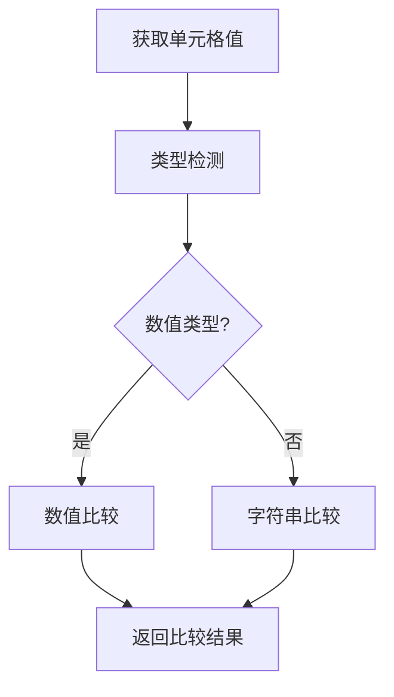

# ai-info项目概述

<cite>
**本文档引用的文件**
- [index.html](file://index.html)
</cite>

## 目录
1. [项目简介](#项目简介)
2. [核心价值与目标用户](#核心价值与目标用户)
3. [项目架构设计](#项目架构设计)
4. [功能特性详解](#功能特性详解)
5. [数据组织结构](#数据组织结构)
6. [用户体验设计](#用户体验设计)
7. [技术实现亮点](#技术实现亮点)
8. [使用场景与应用](#使用场景与应用)
9. [总结](#总结)

## 项目简介

ai-info是一个专为AI研究人员、技术决策者和开发者打造的综合性AI模型信息汇总平台。该项目通过纯前端静态网页架构，为用户提供了一个集中化的AI模型信息查询和对比平台，涵盖了主流AI模型的开源状态、商用成本、性能评估等关键信息。

项目的核心使命是解决AI领域信息碎片化的问题，帮助用户快速了解不同AI模型的特点、优势和适用场景，从而做出更明智的技术选择和商业决策。

**章节来源**
- [index.html](file://index.html#L1-L434)

## 核心价值与目标用户

### 目标用户群体

ai-info项目主要服务于以下几类用户：

1. **AI研究人员**：需要深入了解不同AI模型的技术特性和性能表现
2. **技术决策者**：在企业技术选型过程中需要客观的模型对比信息
3. **开发者**：寻找适合特定应用场景的AI模型解决方案
4. **产品经理**：评估AI功能的可行性和成本效益
5. **投资分析师**：研究AI领域的市场格局和技术趋势

### 项目提供的核心价值

#### 1. 集中化信息管理
- 汇总全球主流AI模型的关键信息
- 提供统一的数据格式和标准化的评估体系
- 减少用户在多个来源间查找信息的时间成本

#### 2. 多维度对比分析
- 开源状态（完全开源、部分开源、闭源）
- 商用成本（按token计费的详细价格信息）
- 性能评估（多模态能力、推理能力、特定优化领域）
- 技术特点（上下文长度、多语言支持、特殊功能）

#### 3. 实时性与准确性
- 定期更新最新的模型版本和定价信息
- 来源明确的数据追踪机制
- 支持直接访问官方文档和资源链接

**章节来源**
- [index.html](file://index.html#L254-L257)
- [index.html](file://index.html#L260-L289)

## 项目架构设计

### 纯前端静态网页架构

ai-info项目采用了极具创新性的纯前端静态网页架构，这一设计理念体现了项目的核心价值观和技术追求。

#### 架构特点

1. **零后端依赖**：整个项目不依赖任何后端服务或数据库
2. **零外部依赖**：不使用任何第三方JavaScript库或框架
3. **完全自包含**：所有功能都通过原生HTML、CSS和JavaScript实现
4. **离线可用**：可以在没有网络连接的情况下正常工作

#### 技术优势

- **部署简单**：只需将HTML文件部署到任何Web服务器即可
- **维护成本低**：无需复杂的后端维护和数据库管理
- **安全性高**：无后端漏洞风险，数据完全本地化
- **加载速度快**：静态文件传输效率极高
- **可靠性强**：不受后端服务可用性影响

### 设计理念

项目的设计理念体现了"简约而不简单"的原则：

- **最小化复杂性**：避免不必要的技术栈复杂度
- **最大化可用性**：确保在各种设备和浏览器上都能正常工作
- **最佳用户体验**：通过精心设计的交互和视觉效果提升使用体验
- **长期可维护性**：采用标准技术栈，确保代码的长期可读性和可维护性

**章节来源**
- [index.html](file://index.html#L1-L251)

## 功能特性详解

### 表格数据展示系统

ai-info项目提供了两个主要的数据展示表格，每个表格都有其独特的功能和用途。

#### 主要模型信息表

这个表格展示了AI模型的核心技术特征和商业信息：

**图表来源**
- [index.html](file://index.html#L261-L289)

#### 基本信息表

这个表格提供了模型的基础信息概览：

**图表来源**
- [index.html](file://index.html#L293-L321)

### 排序功能

项目实现了智能的表格排序功能，支持多种数据类型的排序：

#### 排序算法特点

1. **智能类型识别**：自动识别数字、货币、字符串等不同类型
2. **本地化比较**：使用中文本地化进行字符串比较
3. **稳定排序**：保持相同值之间的相对顺序
4. **双向排序**：支持升序和降序排列

#### 排序实现机制

**图表来源**
- [index.html](file://index.html#L363-L388)

### 列宽调整功能

项目提供了直观的列宽调整功能，用户可以通过拖拽调整表格列的宽度：

#### 调整机制

1. **可视化句柄**：每个表头右侧显示可拖拽的调整手柄
2. **动态计算**：实时计算相邻列的宽度变化
3. **最小宽度限制**：防止列宽过小影响阅读
4. **平滑过渡**：使用CSS过渡效果提升用户体验

#### 技术实现流程

**图表来源**
- [index.html](file://index.html#L391-L424)

### 暗色模式适配

项目完美支持系统的深色模式偏好设置，提供无缝的用户体验：

#### 适配策略

1. **系统检测**：自动检测用户的系统深色模式偏好
2. **渐进式增强**：基于CSS变量的样式系统
3. **视觉一致性**：确保浅色和深色模式下的视觉效果
4. **动画流畅性**：使用CSS过渡实现平滑的颜色切换

**章节来源**
- [index.html](file://index.html#L25-L58)
- [index.html](file://index.html#L346-L431)

## 数据组织结构

### 数据分类体系

ai-info项目采用清晰的数据分类体系，将AI模型信息分为以下几个维度：

#### 1. 技术特征维度
- **开源状态**：完全开源（绿色标识）、部分开源（黄色标识）、闭源（红色标识）
- **性能指标**：多模态能力、推理能力、特定优化领域
- **技术规格**：上下文长度、多语言支持、特殊功能

#### 2. 商业维度
- **定价模型**：按token计费的详细价格信息
- **使用成本**：输入输出token的分别定价
- **商业友好性**：开源可商用程度

#### 3. 基础信息维度
- **模型名称**：官方名称及常用简称
- **版本信息**：最新版本号和发布时间
- **厂商信息**：开发团队和所属公司
- **地域分布**：国内外厂商区分

### 数据质量保证

项目建立了严格的数据质量控制机制：

1. **来源追踪**：每个数据项都附带官方来源链接
2. **定期更新**：根据最后更新日期跟踪信息时效性
3. **交叉验证**：通过多个官方渠道验证数据准确性
4. **透明度**：公开数据收集和验证过程

**章节来源**
- [index.html](file://index.html#L261-L344)

## 用户体验设计

### 视觉设计原则

ai-info项目在视觉设计上遵循了现代Web设计的最佳实践：

#### 色彩系统

项目采用基于CSS变量的色彩系统，确保主题的一致性：

- **主色调**：蓝色系用于强调重要信息
- **状态指示**：绿色表示积极状态，红色表示消极状态，黄色表示中性状态
- **背景层次**：通过微妙的阴影和渐变创造视觉层次感

#### 字体排版

- **中文字体优先**：优先使用中文友好字体
- **响应式设计**：根据不同屏幕尺寸调整字体大小
- **可读性优化**：合理的行高和字间距

### 交互设计

#### 表格交互

1. **悬停效果**：行悬停时提供视觉反馈
2. **点击响应**：排序操作提供即时反馈
3. **触摸友好**：移动端优化的触摸交互

#### 响应式布局

项目针对不同设备进行了优化：

- **桌面端**：完整的功能展示和精细的交互
- **平板端**：适应较宽的屏幕尺寸
- **移动端**：垂直滚动和简化交互

### 可访问性考虑

项目在设计时充分考虑了可访问性需求：

1. **键盘导航**：支持完整的键盘操作
2. **屏幕阅读器**：良好的语义化标记
3. **颜色对比**：满足WCAG可访问性标准
4. **焦点管理**：清晰的焦点指示

**章节来源**
- [index.html](file://index.html#L51-L251)

## 技术实现亮点

### 原生JavaScript实现

项目的所有交互功能都使用原生JavaScript实现，展现了技术实力：

#### 排序功能实现

**图表来源**
- [index.html](file://index.html#L349-L362)

#### 列宽调整实现

项目实现了精确的列宽调整算法：

1. **事件监听**：捕获鼠标按下、移动、释放事件
2. **边界计算**：计算表格和列的精确位置
3. **动态调整**：实时更新CSS样式属性
4. **约束处理**：确保列宽不小于最小值

### 性能优化策略

#### 加载性能

- **零HTTP请求**：单个HTML文件即可运行
- **内联样式**：避免额外的CSS文件请求
- **压缩优化**：去除不必要的空白和注释

#### 运行性能

- **事件委托**：减少事件监听器数量
- **DOM缓存**：缓存频繁访问的DOM元素
- **防抖处理**：优化高频事件的处理

### 兼容性保证

项目确保在主流浏览器上的兼容性：

1. **现代浏览器**：Chrome、Firefox、Safari、Edge
2. **旧版本支持**：基本功能在较老版本浏览器中可用
3. **渐进增强**：高级功能在支持的浏览器中启用

**章节来源**
- [index.html](file://index.html#L346-L431)

## 使用场景与应用

### 快速对比主流AI模型特性

ai-info项目特别适用于需要快速对比不同AI模型特性的场景：

#### 场景1：技术选型决策
- **问题**：企业需要选择最适合的AI模型来支持业务需求
- **解决方案**：通过表格快速对比开源状态、性能特点、成本因素
- **优势**：一站式的信息获取，减少调研时间

#### 场景2：预算规划
- **问题**：需要评估不同模型的使用成本
- **解决方案**：查看详细的token计费信息
- **优势**：直观的成本对比，支持商业可行性分析

#### 场景3：技术调研
- **问题**：研究人员需要了解最新的AI模型发展
- **解决方案**：获取模型的最新版本信息和技术特点
- **优势**：及时的技术动态跟踪

### 商用可行性评估

项目为商业决策提供了重要的参考依据：

#### 成本效益分析
- **直接成本**：token级别的精确计费
- **间接成本**：开源状态对定制化的影响
- **长期成本**：模型演进和维护成本

#### 技术可行性评估
- **功能匹配**：模型能力与业务需求的匹配度
- **集成难度**：开源程度和文档质量
- **扩展性**：模型的可扩展性和定制能力

### 教育和学习用途

项目也适用于教育和学习场景：

#### 学习路径
1. **入门级**：了解AI模型的基本概念和分类
2. **进阶级**：深入理解不同模型的技术特点
3. **专家级**：进行深度的技术对比和分析

#### 研究支持
- **文献综述**：为学术研究提供基础数据
- **案例分析**：支持具体的AI应用案例研究
- **趋势分析**：跟踪AI模型的发展趋势

**章节来源**
- [index.html](file://index.html#L254-L344)

## 总结

ai-info项目代表了现代Web技术在信息聚合和展示方面的创新应用。通过纯前端静态网页架构，项目成功地解决了AI领域信息碎片化的问题，为用户提供了高质量、易用性强的AI模型信息服务平台。

### 项目特色总结

1. **技术创新**：纯前端架构的实现展现了技术实力
2. **用户体验**：精致的设计和丰富的交互功能
3. **实用价值**：真正解决了用户的实际需求
4. **可持续性**：低维护成本和高可靠性

### 发展前景

随着AI技术的快速发展，ai-info项目具有广阔的发展空间：

- **数据扩展**：可以持续添加新的AI模型信息
- **功能增强**：可以引入更多高级的分析功能
- **国际化**：支持多语言版本以服务全球用户
- **社区建设**：可以建立用户贡献和反馈机制

ai-info项目不仅是一个信息汇总平台，更是推动AI知识普及和技术创新的重要工具。它证明了简洁而强大的技术方案能够产生巨大的社会价值，为未来的Web应用开发提供了宝贵的参考经验。